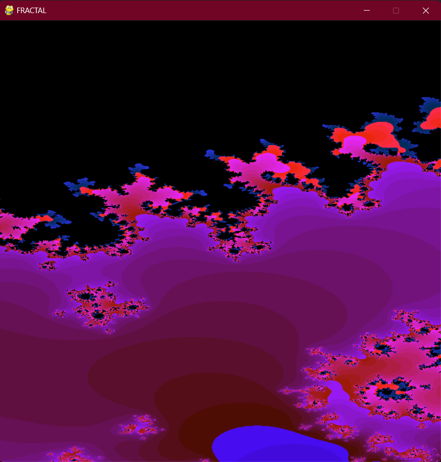

# Fractal-Metodo-Mandelbrot-Python

    

## Descripción
Es la generación de un fractal con el método de Mandelbroc usando Python y su librería Pygame. Se genera especificamente la siguiente ecuación:

Z = Z2 + Z + C

El codigo tambiencuenta con una version para hacer ZOOM al sector del fractal que se seleccione.

## Características
- Fractal 
- Interfaz basada en un ventana.
- Python, Pygame.

## Instrucciones de Uso
1. Ejecuta el codigo en la terminal.
2. Espera a que aparezca la ventana.
3. Haz zoom en los sectores que desee.

## Dependencias
El proyecto utiliza unicamente la biblioteca Pygame.

## Imagenes

    
    

## Licencia
Este proyecto está bajo la Licencia MIT. Consulta el archivo [LICENSE](LICENSE) para obtener más detalles.

---

